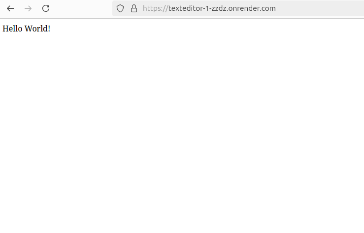
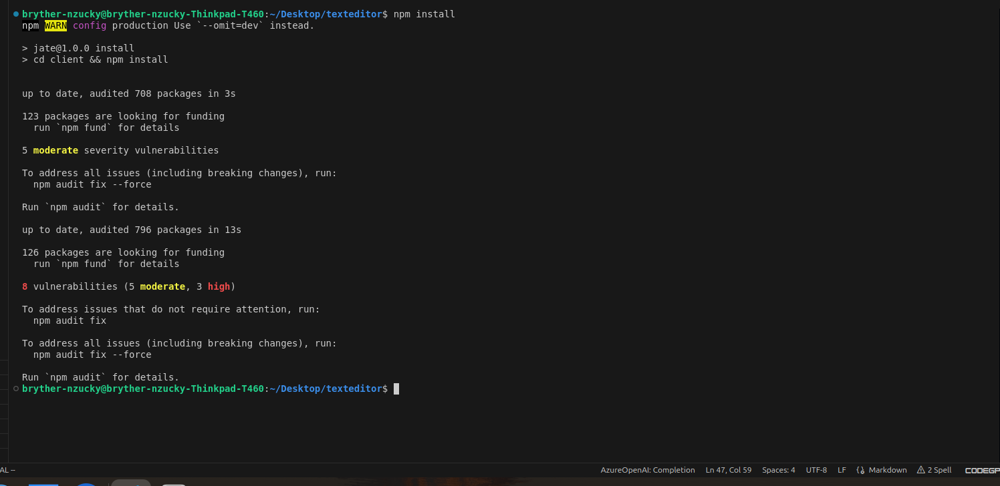
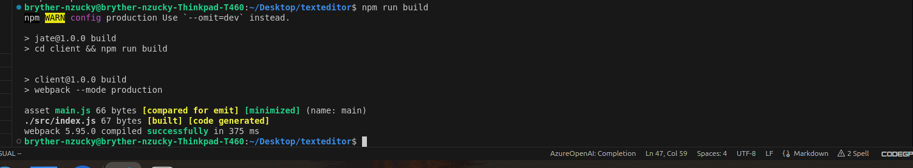
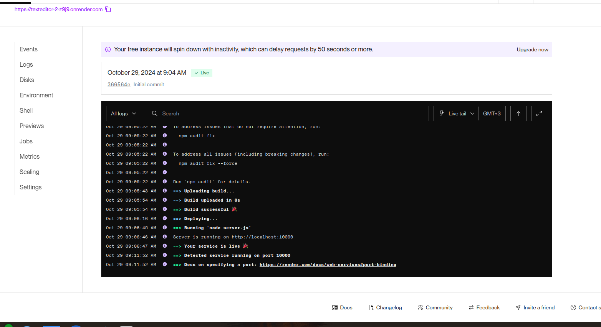

# Just Another Text Editor (J.A.T.E)

## Description
A text editor that runs in the browser and meets PWA criteria. This application features data persistence techniques and will function offline. Users can create notes or code snippets with or without an internet connection.

## Table of Contents
- [Just Another Text Editor (J.A.T.E)](#just-another-text-editor-jate)
  - [Description](#description)
  - [Table of Contents](#table-of-contents)
  - [Features](#features)
  - [Installation](#installation)
  - [Usage](#usage)
  - [Screenshots](#screenshots)
    - [Homepage](#homepage)
    - [Installation Process](#installation-process)
    - [Editor in Use](#editor-in-use)
    - [Build Process](#build-process)
    - [Deployment](#deployment)
  - [Technologies Used](#technologies-used)
  - [License](#license)

## Features
- Create and store notes or code snippets
- Works offline with service worker
- Install as desktop application
- IndexedDB for data persistence
- Webpack bundling
- Babel for backwards compatibility

## Installation
1. Clone the repository
2. Run `npm install` to install dependencies
3. Run `npm run start` to start the development server
4. Open your browser and visit `localhost:3000`

## Usage
1. Open the text editor
2. Start typing your notes or code
3. Content automatically saves when you click off the window
4. Click the Install button to download as a desktop app

## Screenshots

### Homepage

*Text Editor main interface*

### Installation Process

*Installing the PWA on desktop*

### Editor in Use

*Example of editor being used*

### Build Process

*Running npm run build command*

### Deployment

*Application deployed on Heroku*

## Technologies Used
- JavaScript
- Node.js
- Express.js
- IndexedDB
- Webpack
- Workbox
- Babel

## License
MIT License

Copyright (c) 2024 Byron

Permission is hereby granted, free of charge, to any person obtaining a copy
of this software and associated documentation files (the "Software"), to deal
in the Software without restriction, including without limitation the rights
to use, copy, modify, merge, publish, distribute, sublicense, and/or sell
copies of the Software, and to permit persons to whom the Software is
furnished to do so, subject to the following conditions:

The above copyright notice and this permission notice shall be included in all
copies or substantial portions of the Software.

THE SOFTWARE IS PROVIDED "AS IS", WITHOUT WARRANTY OF ANY KIND, EXPRESS OR
IMPLIED, INCLUDING BUT NOT LIMITED TO THE WARRANTIES OF MERCHANTABILITY,
FITNESS FOR A PARTICULAR PURPOSE AND NONINFRINGEMENT. IN NO EVENT SHALL THE
AUTHORS OR COPYRIGHT HOLDERS BE LIABLE FOR ANY CLAIM, DAMAGES OR OTHER
LIABILITY, WHETHER IN AN ACTION OF CONTRACT, TORT OR OTHERWISE, ARISING FROM,
OUT OF OR IN CONNECTION WITH THE SOFTWARE OR THE USE OR OTHER DEALINGS IN THE
SOFTWARE.